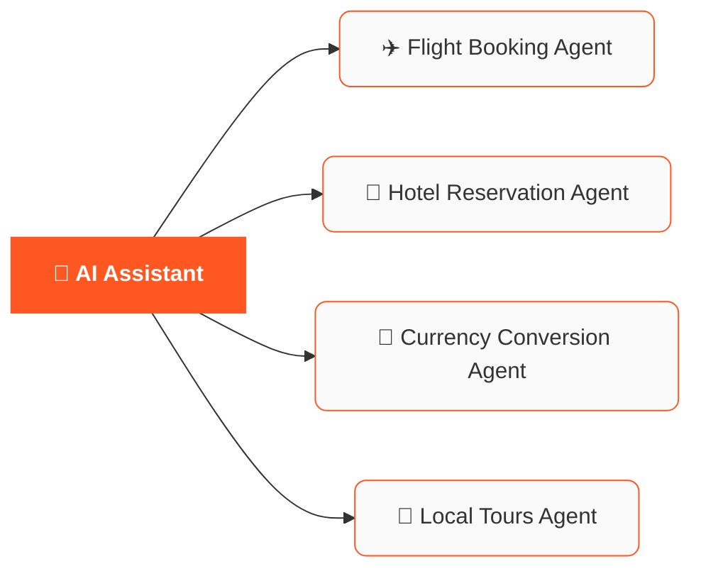

Agents can collaborate to perform complex tasks by communicating with each other.
A2A solves the problem of Agents not being able to communicate with each other because each Agent has its own unique API.

It defines the specifications for communicating with Agents and the format of the messages exchanged between Agents.



## Highlights

- Agents can self-discover each other via an **Agent Card**.
- Supports both immediate responses and long-running tasks.
- Defines security and authentication mechanisms.
- Multiple transport protocols supported: `JSON-RPC`, `gRPC`, and `HTTP + REST`.


## Key concepts

The A2A protocol is comprehensive, and we will cover the most important concepts here.

### Agent Discovery: The Agent Card

Every Agent **must** expose an Agent Card, a JSON object that describes the Agent's identity, capabilities, skills, service endpoint URL, and how clients should authenticate and interact with it.


It is recommended to expose the Agent Card at the endpoint `https://{server_url}/.well-known/agent-card.json`


### Protocol methods

1. `message/send`
2. `message/stream`
3. `tasks/get`
4. `tasks/list`


## A2A with Agentor

Agentor implements the A2A protocol and makes it easy to convert any Agent into an A2A-compatible Agent.

The following example shows how to create an Agent and serve it as an A2A-compatible Agent.

```python
from agentor import Agentor

agent = Agentor(name="Weather Agent", tools=["get_weather"])
agent.serve()
```
