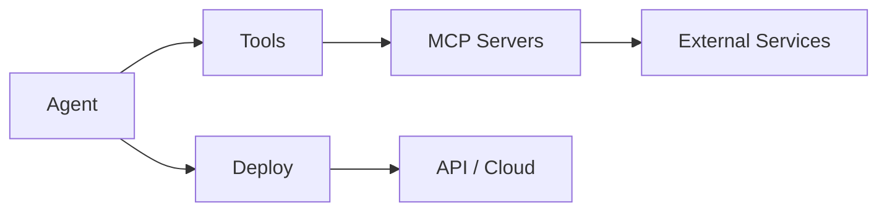

<Info>
  This legacy concepts overview remains available by URL. For the canonical concepts docs, use [Agent Architecture](/agentor/concepts/agents), [Tool System](/agentor/concepts/tools), [MCP](/agentor/concepts/mcp), and [A2A Protocol](/agentor/concepts/a2a-protocol).
</Info>

Before diving into the API, it helps to understand how the pieces fit together.

## The Mental Model



| Component | What it does | When you need it |
|-----------|--------------|------------------|
| **Agent** | LLM-powered reasoning engine that can take actions | Always - this is your starting point |
| **Tools** | Functions the agent can call to interact with the world | When your agent needs to do more than chat |
| **MCP Server** | Standardized protocol for exposing tools to any agent | When you want reusable, shareable tool packages |
| **Deployment** | Run your agent as an API endpoint | When you're ready to integrate with your app |

---

## Agents

An **Agent** is an LLM with instructions and capabilities. At minimum, it needs:

- A **name** for identification
- A **model** (e.g., `gpt-4o`, `claude-sonnet`)
- **Instructions** defining its behavior

```python
from agentor import Agentor

agent = Agentor(
    name="assistant",
    model="gpt-4o",
    instructions="You help users with their questions."
)
```

Without tools, an agent can only respond based on its training data. Add tools to let it take action.

---

## Tools

**Tools** are functions your agent can call. They bridge the gap between "knowing" and "doing."

```python
from agentor.tools import GetWeatherTool, WebSearchTool

agent = Agentor(
    name="research_assistant",
    model="gpt-5",
    tools=[GetWeatherTool(), WebSearchTool()]
)
```

Tools can be:
- **Built-in** - Celesto provides common tools like weather, web search, and more
- **Custom** - Define your own Python functions as tools
- **MCP Servers** - Connect to standardized tool servers

<Tip>
Start with built-in tools. Graduate to custom tools or MCP when you need more control.
</Tip>

---

## MCP (Model Context Protocol)

**MCP** is a standard for packaging and sharing tools. Think of it like an API specification for agent capabilities.

Why MCP matters:
- **Reusability** - Build once, use with any MCP-compatible agent
- **Isolation** - Tools run in their own server process
- **Ecosystem** - Access tools built by the community

```python
# Connect to an MCP server
agent = Agentor(
    name="gmail_assistant",
    model="gpt-5",
    tools=["celesto/gmail", "celesto/calendar"]
)
```

You can also build your own MCP servers with [LiteMCP](/agentor/tools/LiteMCP).

---

## Deployment

Once your agent works locally, **deploy** it to make it accessible as an API.

<Tabs>
  <Tab title="Local API">
    ```python
    agent.serve(port=8000)
    ```
    Run on your machine for development.
  </Tab>
  <Tab title="Celesto Cloud">
    ```bash
    celesto deploy
    ```
    One command to deploy with auto-scaling and monitoring.
  </Tab>
  <Tab title="Self-Hosted">
    ```bash
    docker run -p 8000:8000 your-agent
    ```
    Full control over your infrastructure.
  </Tab>
</Tabs>

---

## Putting It Together

Here's the typical progression:

<Steps>
  <Step title="Start Simple">
    Create an agent with just a model and instructions. Test it works.
  </Step>
  <Step title="Add Capabilities">
    Connect tools so your agent can take actions. Start with built-in tools.
  </Step>
  <Step title="Build Custom Tools">
    When built-ins aren't enough, create custom tools or MCP servers.
  </Step>
  <Step title="Deploy">
    Ship your agent as an API. Start with Celesto Cloud for simplicity.
  </Step>
</Steps>

---

## Next Steps

<CardGroup cols={2}>
  <Card title="Build an Agent" icon="robot" href="/agentor/agents-api">
    Deep dive into the Agent API
  </Card>
  <Card title="Add Tools" icon="wrench" href="/agentor/tools/tool-use">
    Learn how to connect tools
  </Card>
  <Card title="Build MCP Server" icon="server" href="/agentor/tools/LiteMCP">
    Create reusable tool packages
  </Card>
  <Card title="Deploy" icon="cloud" href="/agentor/deploy">
    Ship your agent to production
  </Card>
</CardGroup>
