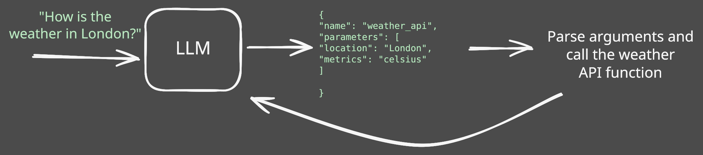

Large Language Models (LLMs) can answer most of the user questions but they can't access or affect the real world.

With access to tools and APIs, LLMs can perform tasks and actions impacting the real world such as booking a flight, sending an email, or updating a database.


## What is an LLM Tool?

When we say "tool", we mean a function that can be called by an LLM to perform a task or action.
But how does an LLM know how to call a tool?


<Tip>The LLM doesn't call the tool directly, it only returns a JSON object with the tool details and the arguments to call the tool.</Tip>




## Tool calling with OpenAI API


```python
from openai import OpenAI

weather_tool_schema = {
    "type": "function",
    "name": "get_weather",
    "description": "Retrieves current weather for the given location.",
    "parameters": {
        "type": "object",
        "properties": {
            "location": {
                "type": "string",
                "description": "City and country e.g. London, United Kingdom",
            },
            "units": {
                "type": "string",
                "enum": ["celsius", "fahrenheit"],
                "description": "Units the temperature will be returned in.",
            },
        },
        "required": ["location", "units"],
        "additionalProperties": False,
    },
    "strict": True,
}

client = OpenAI()

response = client.responses.create(
    model="gpt-5-nano", input="What is the weather in London?", tools=[weather_tool_schema]
)
print(response.content)
```