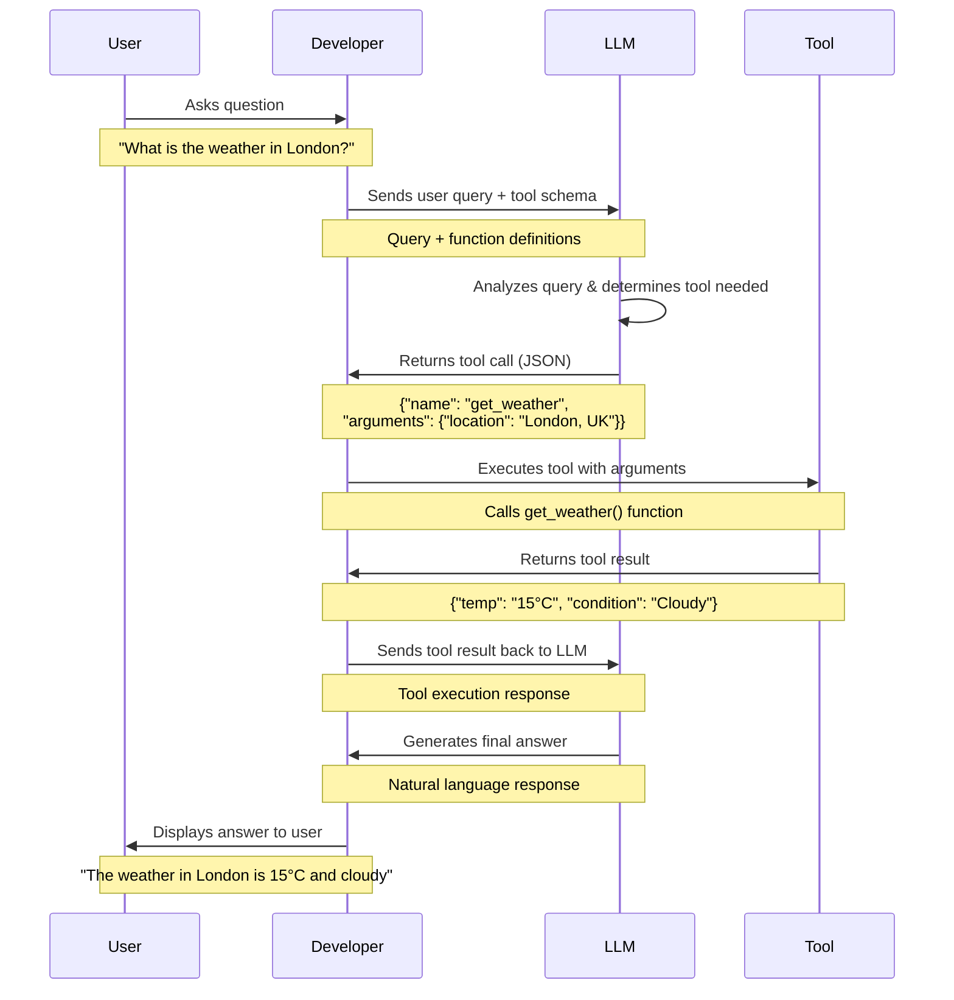

Large Language Models (LLMs) can answer most user questions but they can't access or affect the real world.

With access to tools and APIs, LLMs can perform tasks and actions that impact the real world such as booking a flight, sending an email, or updating a database.


<Card title="Weather Agent Example" img="./overview.png">
  ChatGPT accesses weather using an external API.
</Card>

## What is an LLM Tool?

When we say "tool", we mean a function that can be called by an LLM to perform a task or action.
But how does an LLM know how to call a tool?


<Tip>The LLM doesn't call the tool directly, it only returns a JSON object with the tool details and the arguments to call the tool.</Tip>


## Tool calling with OpenAI API

LLMs first need to know the details of the tool to call it.
This is done by providing a <Tooltip tip="A tool schema is a JSON object containing the details of the function and its arguments">tool schema</Tooltip> to the LLM.

In the following example, we define a tool schema for a weather API function that retrieves the current weather for a given location.

```python
from openai import OpenAI

weather_tool_schema = {
    "type": "function",
    "name": "get_weather",
    "description": "Retrieves the current weather for the given location.",
    "parameters": {
        "type": "object",
        "properties": {
            "location": {
                "type": "string",
                "description": "City and country, e.g. London, United Kingdom",
            },
            "units": {
                "type": "string",
                "enum": ["celsius", "fahrenheit"],
                "description": "The units in which the temperature will be returned.",
            },
        },
        "required": ["location", "units"],
        "additionalProperties": False,
    },
    "strict": True,
}

client = OpenAI()

response = client.responses.create(
    model="gpt-5-nano", input="What is the weather in London?", tools=[weather_tool_schema]
)
print(response.content)
```

The LLM will respond with a JSON containing the _**tool name**_ and the _**arguments**_ to call the tool.
It's the job of the developer to implement the tool and call it with the arguments.
The tool result is then fed back to the LLM to answer the user question.

```python focus={4,6-7}
Response(model='gpt-5-nano-2025-08-07', object='response', output=[
    ResponseReasoningItem(summary=[], type='reasoning', content=None, encrypted_content=None, status=None),
    ResponseFunctionToolCall(
        arguments='{"location":"London, United Kingdom","units":"celsius"}',
        call_id='call_d1K7mBkbN62s4MChtPOkpckW',
        name='get_weather',
        type='function_call',
        id='fc_0945c6bd7187945700690166502f7881978963e94cbe4d4ee5',
        status='completed'
    )
]
)
```

## Tool Calling Flow

The following diagram illustrates the complete flow of tool calling with an LLM:




## MCP Server

MCP Server


