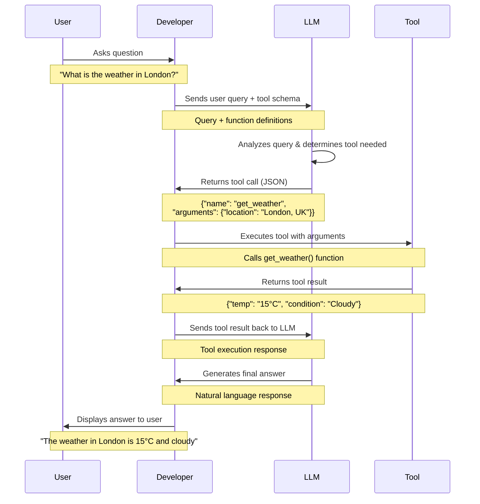
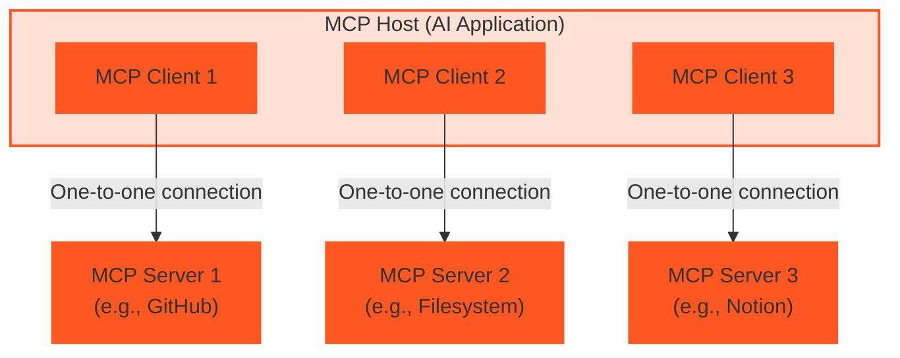

Large Language Models (LLMs) can answer most user questions but they can't access or affect the real world.
With access to tools and APIs, LLMs can perform tasks and actions that impact the real world such as booking a flight, sending an email, or updating a database.

In this section, we will learn about how LLMs make use of tools and what MCP Servers are. You can skip to the next section to learn about [tool use with Agentor](./tool-use).

<Card title="Weather Agent Example" icon="cloud" img="./overview.png" href="https://github.com/CelestoAI/agentor/blob/main/examples/weather_agent.py">
  ChatGPT accesses weather using an external API.
</Card>

## What is an LLM Tool?

When we say **"tool"**, we mean a function that can be called by an LLM to perform a task or action.
But how does an LLM know how to call a tool?


<Tip>The LLM doesn't call the tool directly, it only returns a JSON object with the tool details and the arguments to call the tool.</Tip>


### Tool calling with OpenAI API

LLMs first need to know the details of the tool to call it.
This is done by providing a <Tooltip tip="A tool schema is a JSON object containing the details of the function and its arguments">tool schema</Tooltip> to the LLM.

In the following example, we define a tool schema for a weather API function that retrieves the current weather for a given location.

```python
from openai import OpenAI

weather_tool_schema = {
    "type": "function",
    "name": "get_weather",
    "description": "Retrieves the current weather for the given location.",
    "parameters": {
        "type": "object",
        "properties": {
            "location": {
                "type": "string",
                "description": "City and country, e.g. London, United Kingdom",
            },
            "units": {
                "type": "string",
                "enum": ["celsius", "fahrenheit"],
                "description": "The units in which the temperature will be returned.",
            },
        },
        "required": ["location", "units"],
        "additionalProperties": False,
    },
    "strict": True,
}

client = OpenAI()

response = client.responses.create(
    model="gpt-5-nano",
    input="What is the weather in London?",
    tools=[weather_tool_schema],  #[!code ++]
)
print(response.content)
```

The LLM will respond with a JSON containing the _**tool name**_ and the _**arguments**_ to call the tool.
It's the job of the developer to implement the tool and call it with the arguments.
The tool result is then fed back to the LLM to answer the user question.

```python focus={4,6-7}
Response(model='gpt-5-nano-2025-08-07', object='response', output=[
    ResponseReasoningItem(summary=[], type='reasoning', content=None, encrypted_content=None, status=None),
    ResponseFunctionToolCall(
        arguments='{"location":"London, United Kingdom","units":"celsius"}',
        call_id='call_d1K7mBkbN62s4MChtPOkpckW',
        name='get_weather',
        type='function_call',
        id='fc_0945c6bd7187945700690166502f7881978963e94cbe4d4ee5',
        status='completed'
    )
]
)
```

### Tool calling flow

The following diagram illustrates the complete flow of tool calling with an LLM:

<Card>

</Card>


## MCP (Model Context Protocol) Server

The Model Context Protocol (MCP) is a standardized way for LLM applications to interact with external data sources and functionality. MCP servers expose capabilities through three main abstractions: **Tools**, **Resources**, and **Prompts**.

Let's understand the "why" behind MCP with a comparison between using MCP and not using MCP.

| **Without MCP** | **MCP** |
|-----------------|---------|
| Developers need to implement the tool calling logic in the application. | A prebuilt MCP Server can be plugged into the LLM to provide tools and APIs. |
| Developers need to implement integration logic for all external tools such as weather API, email API, etc. | Think of MCP like a USB-C port for AI applications. |

### Key concepts

- **MCP Host**: The AI application that coordinates and manages one or more MCP clients
- **MCP Client**: A component that maintains a connection to an MCP server and obtains context from the MCP server for the MCP host to use
- **MCP Server**: A program that provides context to MCP clients

### Architecture

MCP follows a client-server architecture where **MCP Clients** (within the MCP Host) connect to **MCP Servers** in a one-to-one relationship. Each client maintains its own dedicated connection to a specific server.



## Next steps

<Card title="Build a custom MCP Server" icon="server" href="/agentor/tools/LiteMCP">
  Build a custom MCP Server with Agentor to connect to your own data sources.
</Card>

<Card title="Celesto AI MCP Hub" icon="server" href="https://celesto.ai/toolhub"> 
  Connect Agent with 100+ MCP Servers with built-in security and authentication.
</Card>
