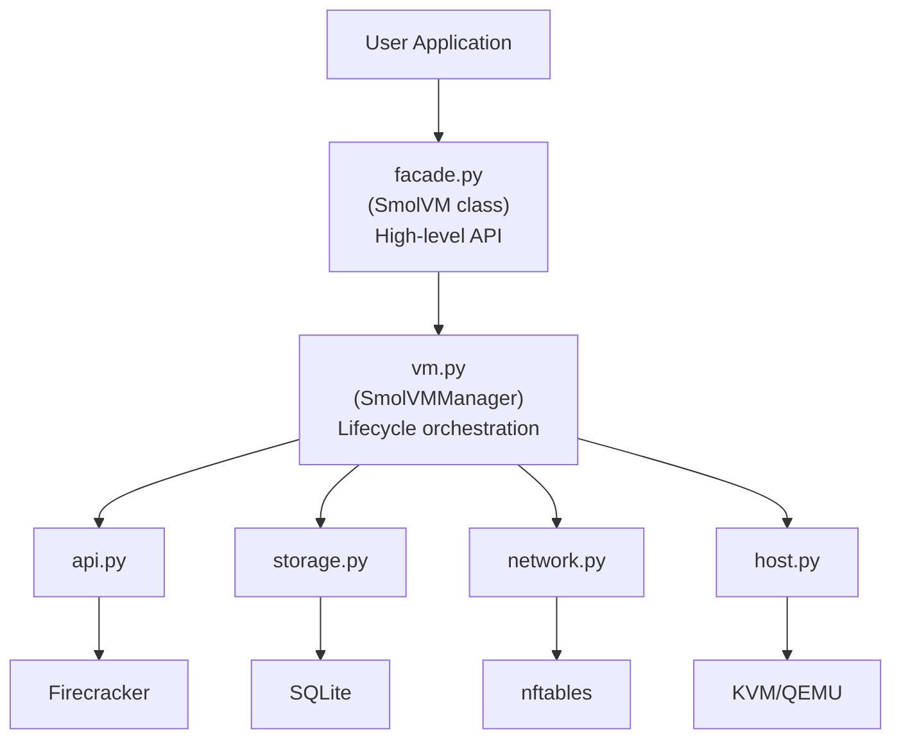
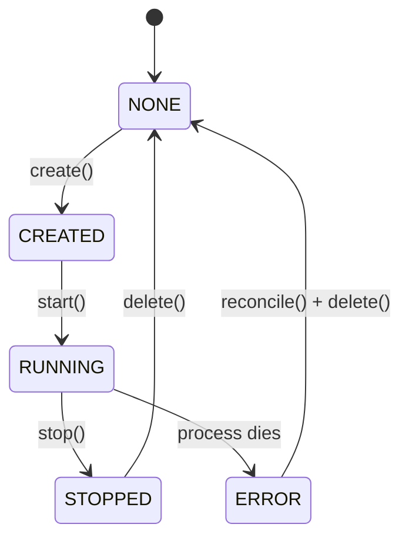

SmolVM is built as a layered system that abstracts Firecracker and QEMU microVMs into a simple Python API. This guide explains the internal architecture and how components interact.

## Architecture Overview

SmolVM follows a clean layered architecture:



### Component Responsibilities

| Component    | Responsibility                                                                         |
| ------------ | -------------------------------------------------------------------------------------- |
| `facade.py`  | User-facing `SmolVM` class with context managers and convenience methods               |
| `vm.py`      | Core orchestrator (`SmolVMManager` class) managing VM lifecycle, networking, and state |
| `api.py`     | Low-level Firecracker HTTP API client over Unix sockets                                |
| `storage.py` | SQLite-based state persistence for VMs, IPs, and port mappings                         |
| `network.py` | Linux networking (TAP devices, NAT, port forwarding via nftables)                      |
| `host.py`    | Environment validation and Firecracker binary management                               |

<Note>
  The `SmolVMManager` class in `vm.py` is exported as part of the public API but is primarily for advanced use cases. Most users should use the high-level `SmolVM` facade class instead.
</Note>

## Data Flow

### VM Creation Flow

```python  theme={null}
from smolvm import SmolVM

vm = SmolVM()  # Creates facade.SmolVM instance
vm.start()     # Triggers creation and start
```

**Internal Flow**:

1. **facade.SmolVM** → Initializes `vm.SmolVMManager`
2. **vm.SmolVMManager.create()** →
   * Validates configuration
   * Determines effective backend (Firecracker/QEMU)
   * Materializes rootfs (isolated copy if needed)
3. **storage.StateManager.create\_vm()** →
   * Creates VM record in SQLite database
   * Sets status to `CREATED`
4. **storage.StateManager.reserve\_ssh\_port()** →
   * Allocates port from pool (2200-2999)
5. **storage.StateManager.allocate\_ip()** → (Firecracker only)
   * Allocates IP from pool (172.16.0.2-254)
   * Derives TAP device name from last octet (e.g., `tap2`)
6. **network.NetworkManager** → (Firecracker only)
   * Creates TAP device: `ip tuntap add tap2 mode tap`
   * Configures TAP: `ip addr add 172.16.0.1/32 dev tap2`
   * Adds route: `ip route add 172.16.0.2 dev tap2`
   * Sets up NAT: `nft add rule nat postrouting ...`
   * Configures SSH forwarding: `nft add rule nat prerouting ...`
7. **storage.StateManager.update\_vm()** →
   * Stores network configuration in database
   * Returns `VMInfo` with complete state

### VM Start Flow

**Firecracker Backend**:

1. **vm.SmolVMManager.start()** →
   * Retrieves VM info from database
   * Validates VM is in `CREATED` or `STOPPED` state
2. **vm.SmolVMManager.\_start\_firecracker()** →
   * Spawns `firecracker --api-sock /tmp/fc-vm-xxxxx.sock`
   * Redirects stdout/stderr to log file
   * Detaches from terminal using `start_new_session=True`
3. **api.FirecrackerClient.wait\_for\_socket()** →
   * Polls until Unix socket exists
   * Validates socket is responsive (`GET /`)
4. **api.FirecrackerClient.set\_boot\_source()** →
   * `PUT /boot-source` with kernel path and boot args
5. **api.FirecrackerClient.set\_machine\_config()** →
   * `PUT /machine-config` with vCPU and memory settings
6. **api.FirecrackerClient.add\_drive()** →
   * `PUT /drives/rootfs` with rootfs path
7. **api.FirecrackerClient.add\_network\_interface()** →
   * `PUT /network-interfaces/eth0` with TAP device and MAC
8. **api.FirecrackerClient.start\_instance()** →
   * `PUT /actions {"action_type": "InstanceStart"}`
   * Firecracker boots Linux kernel
9. **storage.StateManager.update\_vm()** →
   * Updates status to `RUNNING`
   * Stores process PID and socket path

**QEMU Backend**:

1. **vm.SmolVMManager.\_start\_qemu()** →
   * Finds `qemu-system-aarch64` or `qemu-system-x86_64` binary
   * Builds command line arguments
   * Configures user-mode networking (`-netdev user,hostfwd=tcp:...`)
   * Spawns QEMU process with HVF acceleration (macOS) or KVM (Linux)
2. **Process warmup check** →
   * Polls for 2 seconds to detect immediate crashes
   * Validates process didn't exit with error
3. **storage.StateManager.update\_vm()** →
   * Updates status to `RUNNING`
   * Stores process PID

### Command Execution Flow

```python  theme={null}
result = vm.run("echo hello")
```

1. **facade.SmolVM.run()** →
   * Delegates to SSH executor
2. **ssh.SSHExecutor.execute()** →
   * Connects to `localhost:<ssh_host_port>` (QEMU)
   * OR connects to `<guest_ip>:22` (Firecracker)
   * Authenticates using default SSH key
   * Executes command via SSH session
   * Captures stdout/stderr
   * Returns `CommandResult` with exit code and output

### VM Teardown Flow

```python  theme={null}
vm.stop()
vm.delete()  # Or automatic on context manager exit
```

1. **vm.SmolVMManager.stop()** →
   * Retrieves VM info
   * Validates VM is `RUNNING`
2. **Firecracker shutdown**:
   * `api.FirecrackerClient.send_ctrl_alt_del()` (graceful)
   * Waits 0.5s for guest shutdown
   * `os.kill(pid, SIGKILL)` (force)
   * Unlinks Unix socket
3. **QEMU shutdown**:
   * `os.kill(pid, SIGTERM)` (graceful)
   * Waits up to timeout
   * `os.kill(pid, SIGKILL)` if still running
4. **storage.StateManager.update\_vm()** →
   * Sets status to `STOPPED`
   * Clears PID field
5. **vm.SmolVMManager.delete()** →
   * Calls `stop()` if running
   * `vm._cleanup_resources()` →
     * Removes nftables rules (Firecracker)
     * Deletes TAP device (Firecracker)
     * Releases IP lease
     * Releases SSH port
     * Removes isolated disk if applicable
   * `storage.StateManager.delete_vm()` →
     * Deletes VM record (cascades to IP/port leases)

## State Management

SmolVM uses SQLite for durable state persistence across process restarts.

### Database Schema

**vms table**:

```sql  theme={null}
CREATE TABLE vms (
    id TEXT PRIMARY KEY,           -- VM identifier (e.g., vm-abc123)
    status TEXT NOT NULL,          -- CREATED, RUNNING, STOPPED, ERROR
    config TEXT NOT NULL,          -- JSON-serialized VMConfig
    network TEXT,                  -- JSON-serialized NetworkConfig
    pid INTEGER,                   -- Firecracker/QEMU process PID
    socket_path TEXT,              -- Firecracker API socket path
    created_at TEXT NOT NULL,      -- ISO 8601 timestamp
    updated_at TEXT NOT NULL       -- ISO 8601 timestamp
);
```

**ip\_leases table**:

```sql  theme={null}
CREATE TABLE ip_leases (
    ip TEXT PRIMARY KEY,           -- Guest IP (e.g., 172.16.0.2)
    vm_id TEXT NOT NULL UNIQUE,    -- Foreign key to vms(id)
    tap_device TEXT NOT NULL,      -- TAP device name (e.g., tap2)
    created_at TEXT NOT NULL,
    FOREIGN KEY (vm_id) REFERENCES vms(id) ON DELETE CASCADE
);
```

**ssh\_forwards table**:

```sql  theme={null}
CREATE TABLE ssh_forwards (
    vm_id TEXT PRIMARY KEY,        -- Foreign key to vms(id)
    host_port INTEGER NOT NULL UNIQUE,  -- Host-side port (e.g., 2200)
    guest_port INTEGER NOT NULL,   -- Guest-side port (typically 22)
    created_at TEXT NOT NULL,
    FOREIGN KEY (vm_id) REFERENCES vms(id) ON DELETE CASCADE
);
```

### State Transitions



### Concurrency Safety

SmolVM uses SQLite's `EXCLUSIVE` transaction mode for writes to ensure atomic IP/port allocation:

```python  theme={null}
# storage.py:63-86
with self._get_connection(exclusive=True) as conn:
    # Find first available IP
    for i in range(IP_POOL_START, IP_POOL_END + 1):
        ip = f"{IP_PREFIX}{i}"
        if ip not in allocated_set:
            conn.execute(
                "INSERT INTO ip_leases (ip, vm_id, tap_device, created_at) "
                "VALUES (?, ?, ?, ?)",
                (ip, vm_id, tap_device, now),
            )
            return ip
```

This prevents race conditions when multiple processes create VMs simultaneously.

## Networking Architecture

### Firecracker Networking (Linux)

Each VM gets:

* **Dedicated TAP device**: `tap<N>` where N is last octet of guest IP
* **Private IP**: Allocated from `172.16.0.2-254` pool
* **Gateway IP**: `172.16.0.1` (host)
* **NAT**: Outbound internet access via nftables
* **SSH forwarding**: Host port `2200-2999` → guest port `22`

**Network Configuration Example**:

```bash  theme={null}
# TAP device
ip tuntap add tap2 mode tap user alice
ip link set tap2 up
ip addr add 172.16.0.1/32 dev tap2

# Route to guest
ip route add 172.16.0.2 dev tap2

# NAT for outbound traffic
nft add rule nat postrouting oifname != "tap2" ip saddr 172.16.0.2 masquerade

# SSH port forwarding (host:2200 → guest:22)
nft add rule nat prerouting tcp dport 2200 dnat to 172.16.0.2:22
```

### QEMU Networking (macOS/Linux)

QEMU uses user-mode networking (slirp):

* **No TAP devices**: Networking handled entirely by QEMU
* **Guest IP**: Fixed at `10.0.2.15`
* **Gateway IP**: `10.0.2.2` (QEMU virtual gateway)
* **Port forwarding**: Built into QEMU via `-netdev` hostfwd

**QEMU Command Example**:

```bash  theme={null}
qemu-system-aarch64 \
  -netdev user,id=net0,hostfwd=tcp:127.0.0.1:2200-:22 \
  -device virtio-net-device,netdev=net0,mac=52:54:00:12:34:02
```

## Disk Management

SmolVM gives each sandbox its own writable disk by default. That keeps one sandbox's changes from affecting the image you built or another sandbox that starts from the same image.

### Isolated Mode (Default)

In isolated mode, SmolVM creates a per-VM disk under the local state directory:

```
~/.local/state/smolvm/disks/
├── vm-abc123.ext4
├── vm-def456.qcow2
└── vm-ghi789.ext4
```

SmolVM chooses the disk strategy from the backend and root filesystem format:

* **Firecracker** uses a private raw ext4 disk copied from the base rootfs.
* **QEMU with qcow2** creates a thin per-VM qcow2 disk backed by the base image.
* **QEMU with raw ext4** normally creates a qcow2 overlay. When `grow_filesystem=True`, SmolVM uses a raw per-VM disk so host-side ext4 growth can run safely.

When you set `disk_size_mib`, SmolVM grows the per-VM disk before boot. For raw ext4 images, `grow_filesystem=True` also expands the filesystem with `e2fsck` and `resize2fs`. For qcow2 images, SmolVM can grow the virtual disk size, and the guest remains responsible for growing its partition or filesystem.

**Benefits**:

* Complete isolation between VMs
* Base images stay unchanged during resize and boot
* Safe for concurrent VMs

**Tradeoffs**:

* Raw ext4 disks use one copy per VM
* qcow2 overlays depend on their backing image while the VM exists

### Shared Mode

In shared mode, SmolVM boots directly from `rootfs_path`:

```python  theme={null}
from smolvm import VMConfig

config = VMConfig(
    rootfs_path="/path/to/base.ext4",
    disk_mode="shared"
)
```

**Workflow**:

1. Firecracker or QEMU mounts `config.rootfs_path` directly.
2. Changes persist in the base image.
3. SmolVM leaves the disk size unchanged.

**Use cases**:

* Persistent development images
* Lower disk usage
* Read-only workloads when the host enforces read-only access

**Risks**:

* Cross-VM contamination
* Concurrent writes can corrupt filesystem
* Disk resizing is disabled because the base artifact is shared

## Backend Abstraction

SmolVM abstracts the runtime backend behind one SDK and CLI. Most users leave the backend on `auto`, and SmolVM selects the right runtime for the host.

### Firecracker Backend

* **Platform**: Linux only (requires KVM)
* **Hypervisor**: Firecracker microVM monitor
* **Networking**: TAP devices + nftables NAT
* **Control**: Native Firecracker API socket helper from `smolvm-core`
* **Control channel**: SSH or vsock on recent Linux images

### QEMU Backend

* **Platform**: macOS (HVF) and Linux (KVM)
* **Hypervisor**: QEMU full system emulator
* **Networking**: User-mode networking (`slirp`) or TAP mode on Linux
* **Machine model**: `auto` uses QEMU `microvm` for supported Linux x86_64 direct-kernel guests
* **Control**: Native QMP helper from `smolvm-core`
* **Control channel**: SSH or vsock on Linux hosts with recent images

### libkrun Backend

* **Platform**: macOS and Linux when libkrun is installed
* **Hypervisor**: libkrun runtime
* **Status**: Experimental
* **Limitations**: Pause, resume, snapshots, and snapshot restore are not supported yet

### Backend Selection

```python  theme={null}
from smolvm import SmolVM

# Auto-selects Firecracker on Linux and QEMU on macOS.
vm = SmolVM()

# Explicit override.
qemu_vm = SmolVM(backend="qemu")
```

Backend resolution order:

1. Explicit `backend` parameter
2. `SMOLVM_BACKEND` environment variable
3. Auto-detect: `Darwin` -> `qemu`, `Linux` -> `firecracker`

## Security Considerations

### Isolation Boundary

* **Hardware virtualization**: KVM (Linux) or Hypervisor.framework (macOS)
* **Separate kernel**: Each VM runs its own Linux kernel
* **Network isolation**: VMs cannot access each other directly
* **Process isolation**: VM processes run in separate PID namespaces

### Attack Surface

**Smaller than containers**:

* No shared kernel (vs Docker)
* No syscall translation (vs gVisor)
* Minimal device emulation (vs traditional VMs)

**Remaining risks**:

* Hypervisor bugs (Firecracker/QEMU)
* Kernel vulnerabilities (guest → host escalation)
* Network escapes (TAP device bugs)

### SSH Trust Model

<Warning>
  SmolVM uses `paramiko.AutoAddPolicy` by default, which accepts any SSH host key without verification. This is intentional for local development but **should not be used** in production or multi-tenant environments.
</Warning>

See `SECURITY.md` in the source repository for full security policy.

## Extension Points

### Custom State Backend

Replace SQLite with your own database:

```python  theme={null}
from smolvm.storage import StateManager
from smolvm.types import VMInfo, VMConfig

class RedisStateManager(StateManager):
    def create_vm(self, config: VMConfig) -> VMInfo:
        # Store in Redis
        pass
    
    def get_vm(self, vm_id: str) -> VMInfo:
        # Retrieve from Redis
        pass
```

### Custom Network Manager

Implement alternative networking (e.g., OVS, CNI):

```python  theme={null}
from smolvm.network import NetworkManager

class OVSNetworkManager(NetworkManager):
    def create_tap(self, tap_name: str, user: str) -> None:
        # Use ovs-vsctl instead of ip tuntap
        pass
```

### Custom Backend

Add support for other hypervisors (e.g., Cloud Hypervisor, crosvm):

```python  theme={null}
from smolvm.vm import SmolVMManager

class CloudHypervisorManager(SmolVMManager):
    def _start_vm(self, vm_info: VMInfo) -> subprocess.Popen:
        # Launch cloud-hypervisor instead of firecracker
        pass
```

## Performance Design

Key optimizations:

1. **Fast-path shutdown**: SIGKILL instead of graceful shutdown for ephemeral VMs
2. **Lazy resource allocation**: Network setup only on first boot
3. **Connection pooling**: Reuse SSH connections for multiple commands
4. **Minimal device emulation**: Firecracker only emulates virtio devices
5. **Direct kernel boot**: No bootloader overhead

See the [Performance Guide](/smolvm/advanced/performance) for benchmarks and tuning tips.
