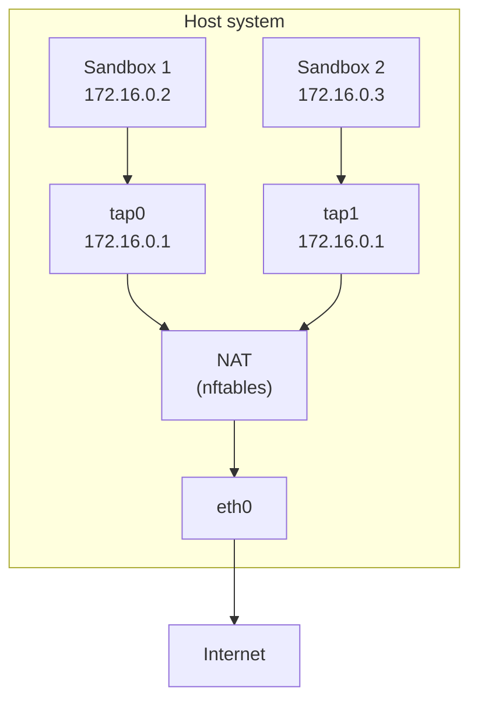
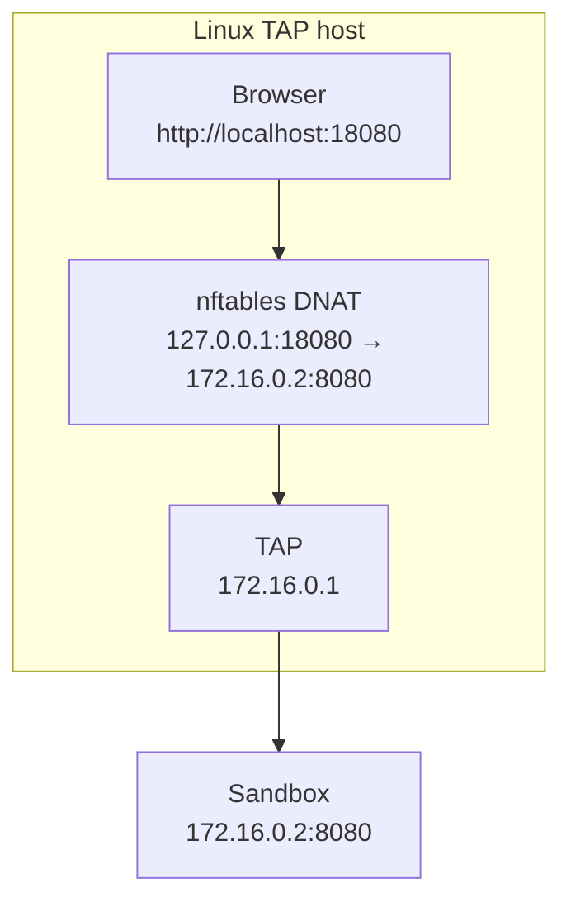

Every SmolVM sandbox gets a private network connection. Internet access is open by default, and you can turn it off or restrict supported Linux networks to specific destinations. Most applications need no network setup.

## How it works

QEMU uses `slirp` by default on macOS and Linux. Slirp is a user-mode network built into QEMU, so it needs no administrator privileges or host network device.

Firecracker and explicit QEMU `qemu_network="tap"` use a TAP device on Linux. A TAP device is a virtual network interface connecting one sandbox to the host. The sandbox receives a private IP address and uses network address translation (NAT) to reach the internet through the host.



On the Linux TAP path, each sandbox receives:

* **Guest IP**: an address in the `172.16.0.2` – `172.16.0.255` range
* **Gateway**: `172.16.0.1` (the host side of the TAP device)
* **Netmask**: `255.255.255.0` (`/24`)

SmolVM assigns these automatically. QEMU only uses this path when you explicitly select TAP.

## Sandbox isolation

Sandboxes are isolated from each other by default. On Linux TAP, SmolVM adds a firewall rule that drops traffic between sandbox interfaces:

```bash
# This rule is added automatically
nft add rule inet smolvm_filter forward iifname "tap*" oifname "tap*" counter drop
```

With default open access, a sandbox can:

* Access the internet via NAT
* Be reached from the host via [port forwarding](/smolvm/features/port-forwarding)
* **Not** communicate directly with other sandboxes

<Note>
  Use [Network controls](/smolvm/features/network-controls) to turn outbound access off or allow specific destinations. QEMU off mode works with the default network on macOS and Linux; restricted IPv4 destinations require explicit TAP networking on Linux.
</Note>

## TAP devices

A TAP device is a virtual network interface that connects a sandbox to the host networking stack. SmolVM creates one TAP device per sandbox and removes it when the sandbox is deleted.

The lifecycle of a TAP device:

1. **Create** — SmolVM runs `ip tuntap add` to create a virtual interface
2. **Configure** — assigns the host-side IP and brings the link up
3. **Route** — adds a host route so packets reach the sandbox
4. **Cleanup** — deletes the TAP device when the sandbox stops

All of this is handled automatically. You only need to interact with TAP devices if you are debugging networking issues.

## Linux TAP NAT and firewall rules

For Firecracker and QEMU TAP, SmolVM uses [nftables](https://wiki.nftables.org/) to manage NAT and firewall rules. It creates two tables:

* `ip smolvm_nat` — handles NAT (masquerade for outbound traffic, DNAT for port forwarding)
* `inet smolvm_filter` — handles forwarding rules and sandbox isolation

When a sandbox starts, SmolVM:

1. Enables IP forwarding on the host (`net.ipv4.ip_forward=1`)
2. Adds a masquerade rule so outbound traffic appears to come from the host
3. Adds a forwarding rule to allow traffic from the sandbox's TAP device to the internet
4. Adds an isolation rule to block sandbox-to-sandbox traffic

You can inspect the active rules at any time:

```bash
sudo nft list table ip smolvm_nat
sudo nft list table inet smolvm_filter
```

## Port forwarding

SmolVM supports two types of port forwarding to reach services running inside a sandbox.

### SSH port forwarding

When a sandbox uses SSH, SmolVM makes its SSH port reachable from the host. QEMU `slirp` uses QEMU's built-in host forwarding. Linux TAP uses a localhost nftables rule.

You can connect manually with the assigned host port:

```bash
ssh -p <host_port> root@localhost
```

Or use the SDK, which handles the configured SSH or `vsock` command connection through `vm.run()`.

### Application port forwarding

To access a web server, database, or other service running inside a sandbox, use `expose_local()`:

```python
from smolvm import SmolVM

with SmolVM() as vm:
    vm.run("python3 -m http.server 8080 &")
    host_port = vm.expose_local(guest_port=8080, host_port=18080)
    print(f"Service available at http://localhost:{host_port}")
```

QEMU `slirp` uses QEMU's built-in forwarding. Linux TAP uses a localhost nftables rule. Both keep the service private to your machine.

The following diagram shows the Linux TAP path:



<Warning>
  `expose_local()` only binds to `127.0.0.1` (localhost). Services are not exposed to your network. If you need external access, set up additional forwarding outside of SmolVM.
</Warning>

Applications should listen on `0.0.0.0` inside the sandbox. For an application that listens only on guest `127.0.0.1`, pass `guest_loopback=True`; this uses an SSH tunnel.

See the [port forwarding guide](/smolvm/features/port-forwarding) for more examples including automatic port allocation, multiple forwards, and troubleshooting.

## Linux TAP prerequisites

Firecracker and QEMU TAP need the following tools on Linux:

* `ip` (from iproute2) — manages TAP devices and routes
* `nft` (from nftables) — manages NAT and firewall rules
* `sudo` access for networking commands

The `smolvm setup` command installs these automatically. You can verify your setup with:

```bash
smolvm doctor
```

## Troubleshooting

<AccordionGroup>
  <Accordion title="Sandbox has no internet access">
    Check that IP forwarding is enabled and NAT rules are in place:

    ```bash
    # Should return 1
    cat /proc/sys/net/ipv4/ip_forward

    # Enable manually if needed
    sudo sysctl -w net.ipv4.ip_forward=1

    # Check NAT rules exist
    sudo nft list table ip smolvm_nat
    ```
  </Accordion>

  <Accordion title="'ip' or 'nft' command not found">
    Install the missing package:

    ```bash
    # Ubuntu/Debian
    sudo apt install iproute2 nftables

    # Fedora/RHEL
    sudo dnf install iproute nftables
    ```
  </Accordion>

  <Accordion title="Permission denied on TAP creation">
    Run the SmolVM system setup to configure sudo permissions:

    ```bash
    sudo ./scripts/system-setup.sh --configure-runtime
    ```
  </Accordion>

  <Accordion title="Port forwarding not working">
    Check that `route_localnet` is enabled for the TAP device and forwarding rules exist:

    ```bash
    # Should return 1
    cat /proc/sys/net/ipv4/conf/tap0/route_localnet

    # Check forwarding rules
    sudo nft list chain inet smolvm_filter forward
    ```

    Also verify that the service inside the sandbox is binding to `0.0.0.0`, not `127.0.0.1`.
  </Accordion>

  <Accordion title="TAP device persists after sandbox deletion">
    If cleanup failed, remove the device manually:

    ```bash
    # List TAP devices
    ip link show | grep tap

    # Delete manually
    sudo ip link delete tap0

    # Or clean up all SmolVM resources
    smolvm sandbox delete --all --force
    ```
  </Accordion>
</AccordionGroup>

## Next steps

* Review the [security model](/smolvm/concepts/security)
* Choose your [backend](/smolvm/concepts/backends) (Firecracker vs. QEMU)
* Read the [architecture overview](/smolvm/concepts/overview)
